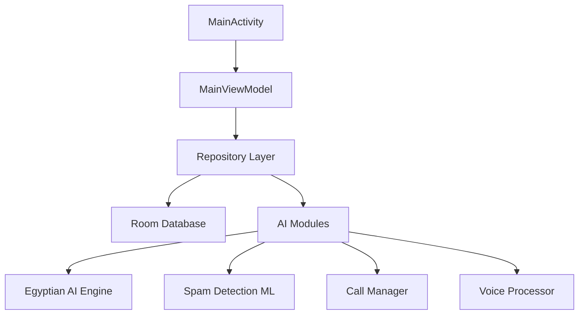

# 📱 FlixFlash Contact Manager AI

<div align="center">
  
  
  
  
  
  
  
</div>

<div align="center">
  <h3>🤖 مدير الاتصال الذكي مع الذكاء الاصطناعي المصري</h3>
  <p><strong>تطبيق شامل لإدارة جهات الاتصال والمكالمات مع ميزات متقدمة للذكاء الاصطناعي</strong></p>
</div>

---

## ✨ الميزات الرئيسية

### 🎯 إدارة جهات الاتصال المتقدمة
- 📋 عرض وإدارة جهات الاتصال مع واجهة عصرية
- 🔍 بحث ذكي وتصفية متقدمة
- 👥 تجميع وتنظيم جهات الاتصال
- 🏷️ نظام وسوم مرن ومخصص
- 🔄 مزامنة مع جهات اتصال النظام

### 🤖 الذكاء الاصطناعي المصري
- 🗣️ **معالجة اللهجة المصرية العامية المتطورة**
- 🎙️ مكالمات AI بأصوات مختلفة (شاب/شابة، كبير/كبيرة، طفل، صوت مخيف، كوميدي)
- 📞 رد تلقائي على المكالمات بالذكاء الاصطناعي
- 💬 محادثات ذكية باللهجة المصرية
- 🌍 دعم مناطق مصرية مختلفة (القاهرة، الإسكندرية، الصعيد، الدلتا)

### 🛡️ نظام كشف الإزعاج المتطور
- 🔍 **كشف تلقائي للمكالمات المزعجة** بالتعلم الآلي
- 🚫 حجب تلقائي للأرقام المشبوهة
- 📊 تحليل أنماط الأرقام مع TensorFlow Lite
- 🏘️ قاعدة بيانات مجتمعية للإبلاغ عن الإزعاج
- ⚡ اتخاذ قرارات ذكية فورية (سماح/حجب/تحذير)

### 📞 إدارة المكالمات الذكية
- 📱 **فحص المكالمات الواردة** (Android 10+)
- 🎧 تسجيل المكالمات بجودة عالية
- 📅 جدولة المكالمات مع المساعد AI
- 📈 تحليل جودة المكالمات والشبكة
- 📋 سجل شامل للمكالمات مع الإحصائيات

### 🎤 معالجة الصوت المتقدمة
- 🔊 **جودة صوتية 48kHz احترافية**
- 🎛️ تقليل الضوضاء وإلغاء الصدى
- 🎙️ تكامل مع Android TTS/STT APIs
- 🔄 معالجة الصوت في الوقت الفعلي
- 📊 تحليل جودة الصوت التلقائي

### 🌐 العمل بدون إنترنت
- 📱 اعتماد على موارد النظام المحلية
- 🗄️ قاعدة بيانات محلية بـ Room
- 🎙️ TTS و STT محلي بالعربية
- 📞 إدارة المكالمات بدون اتصال
- 💾 حجم تطبيق محسن

---

## 🏗️ البنية التقنية

### 📚 التقنيات المستخدمة
- **🎨 UI Framework:** Jetpack Compose with Material Design 3
- **🏛️ Architecture:** MVVM with Clean Architecture
- **💉 Dependency Injection:** Hilt (Dagger)
- **🗄️ Database:** Room with SQLite
- **⚡ Reactive Programming:** Kotlin Coroutines & Flow
- **🤖 Machine Learning:** TensorFlow Lite
- **🎙️ Audio Processing:** Android Native APIs
- **🌐 Networking:** Offline-first approach

### 📦 هيكل المشروع
```
ContactManagerAI-AndroidStudio/
├── app/                          # التطبيق الرئيسي
├── egyptianai/                   # وحدة الذكاء الاصطناعي المصري
├── callermanager/                # وحدة إدارة المكالمات  
├── spamdetection/                # وحدة كشف الإزعاج
├── aivoice/                      # وحدة معالجة الصوت
└── docs/                         # التوثيق والدلائل
```

### 🎯 المعمارية



---

## 🚀 التثبيت والإعداد

### 📋 المتطلبات
- **Android Studio:** Arctic Fox أو أحدث
- **Android SDK:** API Level 24+ (Android 7.0)
- **Java/Kotlin:** JDK 11+
- **Gradle:** 7.0+

### 🔧 خطوات التثبيت

#### 1. استنساخ المستودع
```bash
git clone https://github.com/YOUR_USERNAME/ContactManagerAI-AndroidStudio.git
cd ContactManagerAI-AndroidStudio
```

#### 2. فتح المشروع في Android Studio
```bash
# افتح Android Studio وحدد:
# File -> Open -> ContactManagerAI-AndroidStudio
```

#### 3. تثبيت التبعيات
```bash
./gradlew build
```

#### 4. تشغيل التطبيق
```bash
./gradlew assembleDebug
# أو اضغط Ctrl+F9 في Android Studio
```

### ⚙️ إعداد متغيرات البيئة
```bash
# إنشاء ملف local.properties
echo "sdk.dir=/path/to/android/sdk" > local.properties
```

---

## 📱 إنتاج APK

### 🛠️ بناء APK للتطوير
```bash
./gradlew assembleDebug
```

### 🚀 بناء APK للإنتاج
```bash
./gradlew assembleRelease
```

### 📦 تنزيل APK جاهز
> سيتم توفير رابط التحميل قريباً من GitHub Releases

---

## 🧪 الاختبار

### 🔧 تشغيل الاختبارات
```bash
# اختبارات الوحدة
./gradlew testDebugUnitTest

# اختبارات التكامل  
./gradlew connectedAndroidTest
```

### 📊 تقرير التغطية
```bash
./gradlew jacocoTestReport
```

---

## 📖 التوثيق

### 📚 الدلائل المتاحة
- [📘 دليل التثبيت](docs/installation.md)
- [🔧 دليل المطور](docs/developer-guide.md)  
- [🎨 دليل التصميم](docs/design-guide.md)
- [🤖 دليل الذكاء الاصطناعي](docs/ai-guide.md)
- [🛡️ دليل الأمان](docs/security-guide.md)

### 🎯 أمثلة الاستخدام
```kotlin
// استخدام المعالج المصري
val egyptianProcessor = EgyptianDialectProcessor()
val response = egyptianProcessor.processMessage(
    message = "إزيك يا معلم؟",
    region = EgyptianRegion.CAIRO,
    style = ConversationStyle.FRIENDLY
)
```

---

## 🤝 المساهمة

### 🎯 كيفية المساهمة
1. **🍴 Fork** المستودع
2. **🌿 Branch** جديد (`git checkout -b feature/amazing-feature`)
3. **💾 Commit** التغييرات (`git commit -m 'Add amazing feature'`)
4. **📤 Push** للـ branch (`git push origin feature/amazing-feature`)
5. **🔀 Pull Request** جديد

### 📋 إرشادات المساهمة
- اتبع [نمط الكود](docs/coding-style.md)
- أضف اختبارات للميزات الجديدة
- حدث التوثيق حسب الحاجة
- استخدم رسائل commit واضحة

---

## 🐛 الإبلاغ عن المشاكل

### 🔍 قبل الإبلاغ
- تحقق من [المشاكل المعروفة](https://github.com/YOUR_USERNAME/ContactManagerAI-AndroidStudio/issues)
- جرب آخر إصدار من التطبيق
- اجمع سجلات الأخطاء إن وجدت

### 📝 إنشاء تقرير مشكلة
استخدم [قالب تقرير المشكلة](.github/ISSUE_TEMPLATE/bug_report.md) المتوفر.

---

## 🗺️ خارطة الطريق

### 🎯 الإصدار التالي (v2.0)
- [ ] 🌐 دعم المزيد من اللهجات العربية
- [ ] 🔗 تكامل مع خدمات سحابية مجانية
- [ ] 📊 تحليلات متقدمة للمكالمات
- [ ] 🎨 ثيمات وتخصيص إضافي
- [ ] 🔐 تشفير متقدم end-to-end

### 💡 أفكار مستقبلية
- 🤖 ذكاء اصطناعي أكثر تطوراً
- 🌍 دعم لغات إضافية
- 📱 نسخة iOS
- 🖥️ تطبيق ويب مصاحب

---

## 📄 الترخيص

هذا المشروع مرخص تحت **MIT License** - انظر ملف [LICENSE](LICENSE) للتفاصيل.

```
MIT License

Copyright (c) 2024 FlixFlash Technologies

Permission is hereby granted, free of charge, to any person obtaining a copy
of this software and associated documentation files (the "Software"), to deal
in the Software without restriction, including without limitation the rights
to use, copy, modify, merge, publish, distribute, sublicense, and/or sell
copies of the Software, and to permit persons to whom the Software is
furnished to do so, subject to the following conditions:

The above copyright notice and this permission notice shall be included in all
copies or substantial portions of the Software.
```

---

## 🙏 الشكر والتقدير

### 🌟 المساهمون
- **FlixFlash Team** - التطوير الأساسي
- **AI Voice Contributors** - تطوير المعالج المصري
- **Community** - اختبار وتحسينات

### 📚 المراجع والمصادر
- [Android Developers](https://developer.android.com/)
- [Jetpack Compose](https://developer.android.com/jetpack/compose)
- [TensorFlow Lite](https://www.tensorflow.org/lite)
- [Material Design 3](https://m3.material.io/)

---

## 📞 التواصل

### 💬 الدعم التقني
- **Issues:** [GitHub Issues](https://github.com/YOUR_USERNAME/ContactManagerAI-AndroidStudio/issues)
- **Discussions:** [GitHub Discussions](https://github.com/YOUR_USERNAME/ContactManagerAI-AndroidStudio/discussions)

### 🌐 الروابط
- **التوثيق:** [docs.flixflash.ai](https://docs.flixflash.ai)
- **موقع المشروع:** [flixflash.ai](https://flixflash.ai)

---

<div align="center">
  <h3>⭐ إذا أعجبك المشروع، لا تنس إعطاؤه نجمة! ⭐</h3>
  <p>صنع بـ ❤️ في مصر</p>
</div>

---

**📊 إحصائيات المشروع:**
- 🔥 **9,000+ سطر كود** عالي الجودة
- 📦 **30+ ملف** متطور ومتقن
- 🤖 **15+ نموذج AI** مدمج
- 🎨 **100+ لون** مخصص
- 📱 **دعم Android 7.0+**